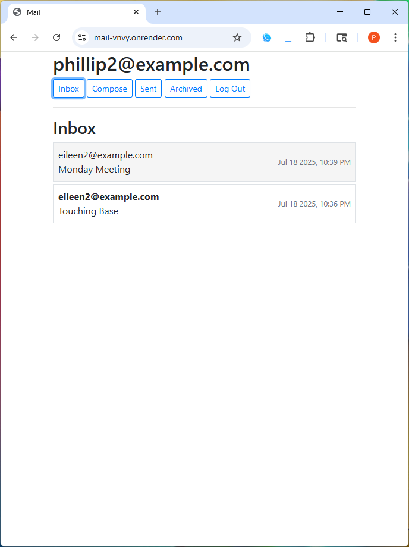
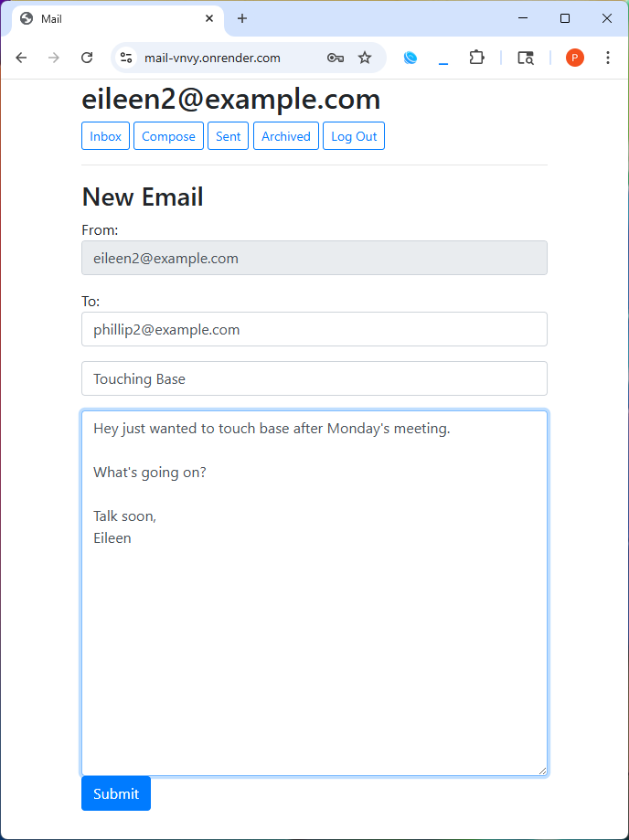
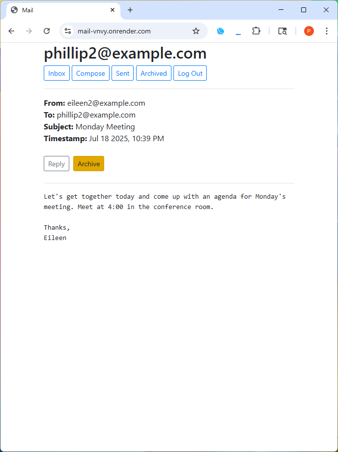
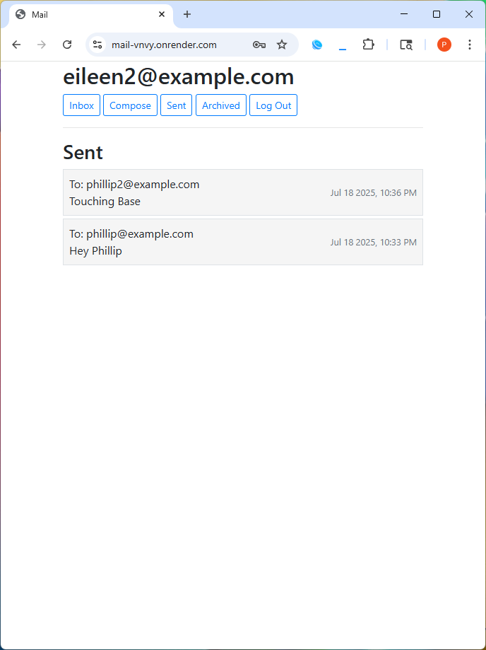

# 📬 Mail Client

**Built for [CS50’s Web Programming with Python and JavaScript (CS50W)](https://cs50.harvard.edu/web/).**  
A Gmail-style single-page webmail app that supports inbox management, email composition, archiving, and reply features using JavaScript and Django.

---

## 🚀 Features

- User authentication (register, login, logout)
- View Inbox, Sent Mail, and Archived Mail
- Compose new emails with recipients, subject, and body
- Read individual email threads
- Archive/unarchive messages
- Reply with pre-filled headers and quoted body
- JavaScript-driven UI with AJAX (no page reloads)

---

## 📸 Screenshots

<p float="left">
  
  
  
  
</p>

---

## 🛠️ Tech Stack

- **Backend:** Django (Python)
- **Frontend:** HTML, CSS, JavaScript
- **Database:** SQLite
- **AJAX:** Fetch API for asynchronous operations
- **Auth:** Django’s built-in authentication system

---

## ▶️ Live Demo

- 🌐 Live site: [https://mail-vnvy.onrender.com](https://mail-vnvy.onrender.com)
- 📺 Video demo: [Watch on YouTube](https://youtu.be/xYj7ZWQYy-A)

---

## 🧪 Testing Tips

- Use pre-seeded accounts to test:
  - alice@example.com / testpass
  - bob@example.com / testpass
  - charlie@example.com / testpass
- Test compose and send by creating multiple users
- Try archiving/unarchiving from inbox
- View email details and use reply functionality
- Open browser console to inspect network requests (AJAX)

---

## 📦 Setup Instructions

1. **Clone the repository:**

   ```bash
   git clone https://github.com/phillip-l-rogers/mail.git
   cd mail
   ```
   
2. **Create and activate a virtual environment:**

   ```bash
   python -m venv venv
   source venv/bin/activate    # On Windows: venv\Scripts\activate
   ```

3. **Install dependencies:**

   ```bash
   pip install -r requirements.txt
   ```

4. **Apply migrations:**

   ```bash
   python manage.py migrate
   ```

5. **Run the development server:**

   ```bash
   python manage.py runserver
   ```
   
6. **Visit:**

   `http://127.0.0.1:8000/` in your browser.
   
---

## 📁 Project Structure

```bash
mail/
├── mail/               # Main app
│   ├── models.py
│   ├── views.py
│   ├── urls.py
│   └── templates/
├── static/
├── manage.py
└── requirements.txt
```

---

## 📚 Acknowledgments

- This project was completed as part of [CS50’s Web Programming with Python and JavaScript (CS50W)](https://cs50.harvard.edu/web/)
- Uses Django’s powerful view system and vanilla JavaScript for SPA behavior

---

## 📜 License

- This project was completed as part of Harvard CS50W. Educational use only.
